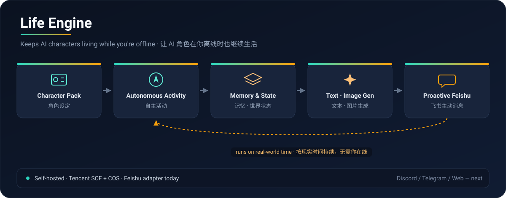

# Life Engine

> **Life Engine is a self-hosted engine for AI characters that keep living even when you're offline.**
>
> 一个让 AI 角色在你离线时，也能继续生活的自部署引擎。

<p align="center">
  
</p>

Instead of a chatbot that only reacts when you message it, a Life Engine character runs on real-world time: it acts while you are away, forms memories, discovers its world, updates its own state, and reaches out to you on its own. Feishu is the currently supported chat integration; the engine itself is platform-agnostic.

一个可自部署的持续生活型 AI Agent 引擎：让虚拟角色在用户离线时继续行动、形成记忆、更新状态，并通过飞书主动发送消息。角色的人设、世界、视觉规则和初始设定都来自版本化的 JSON 角色包，你可以整包替换成自己的角色。

## Features

- **Persistent memory** — layered short/long-term memory and a world model that only grows from what the character actually observes.
- **Autonomous activity** — the character lives on a schedule, explores, pursues goals, and keeps promises across days, even with no user input.
- **Proactive messaging** — it starts conversations, follows up, and shares moments instead of waiting to be prompted.
- **Image generation** — optional life photos grounded in the current world state, using reference images you own.
- **Character packs** — persona, world, visual rules and initial entities as versioned JSON. Update the pack without wiping the running save.
- **Pluggable integration** — Feishu today; the messaging layer is an adapter, so Discord / Telegram / a web front-end can be added later.

## How it works

The core is a **Life Engine** that owns the character's memory, world, goals and state. A thin **integration adapter** connects it to a chat platform. The current production path runs serverless on Tencent Cloud:

1. Feishu app bot receives an event.
2. A Tencent SCF ingress function writes it to a private COS bucket.
3. A COS trigger invokes the SCF processor function.
4. The processor calls your text / vision / image APIs and writes state back to COS.

A scheduled trigger lets the character act on its own between messages.

## Quickstart (local, no deploy)

Requires Node.js 18+.

```powershell
npm install
npm run check
npm test
node scripts/character-pack.mjs validate examples/harbor-fox.json
```

`npm install` generates `package-lock.json`. Never commit local secret files (`.env`, `.runtime-secrets`, `.dev.vars`) or private images.

Build the deployment bundles (Windows PowerShell):

```powershell
npm run package:scf:cos
```

This produces `scf-ingress.zip` and `scf-processor.zip`. Record the SHA-256 of what you upload. Full steps: [`docs/DEPLOYMENT.md`](docs/DEPLOYMENT.md).

## Your character

Ship a character as a pack. The repo includes a fictional example, [`examples/harbor-fox.json`](examples/harbor-fox.json) (a red fox in a small harbor town, `assets: []`), so you can run text mode immediately and replace it wholesale.

```powershell
node scripts/character-pack.mjs prepare examples/harbor-fox.json examples/instance.example.json activation-plan.json
```

`prepare` only writes an upload manifest and environment variables — it never uploads, changes permissions, or calls a model. Wire `LIFE_ENGINE_PACK_KEY`, `LIFE_ENGINE_PACK_SHA256` and `LIFE_ENGINE_CONFIG_JSON` into the processor. The ingress function, processor and the COS `inbox/` trigger must share one `storage_prefix`.

Pack format and rules: [`docs/CHARACTER_PACKS.md`](docs/CHARACTER_PACKS.md). Environment template: [`examples/scf.env.example`](examples/scf.env.example).

## Models & cost

Text, vision and image generation all point at **your own** APIs via environment variables (OpenAI-compatible text by default; image generation adapters are optional). Life Engine ships no API quota and creates no cloud resources for you. Paid calls, real message sending and production deployment are yours to authorize and fund.

## Roadmap

- **Integrations:** Feishu is the currently supported adapter. Discord, Telegram and a web front-end are natural next targets since messaging is decoupled from the engine.
- **Characters:** richer pack tooling and more example packs.

## License

Released under the [MIT License](LICENSE) — use, modify and redistribute freely, keeping the copyright and license notice. Dependency licenses and asset notes: [`docs/LICENSING.md`](docs/LICENSING.md) and [`NOTICE`](NOTICE). Reference images or generated content you add are your responsibility to license.
